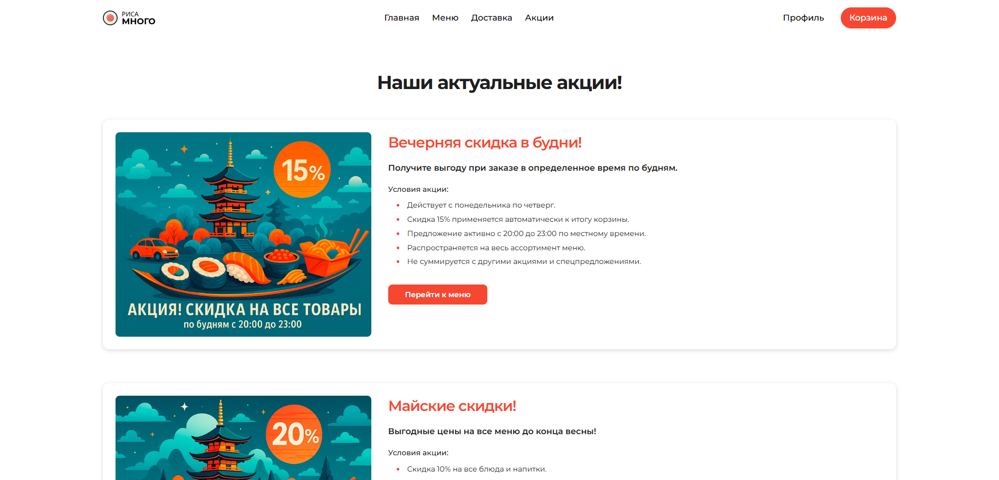

# ecommerce-portfolio-project

## A Minimal Full-Stack E-commerce Application (Food Delivery)

### Overview

This repository contains the code for a minimal yet fully functional e-commerce website, developed as a core project for my portfolio. It simulates an online store for **"Риса Много,"** a food delivery service specializing in **sushi, rolls, and WOK**.

The project serves as a practical demonstration of my skills in building modern web applications across the full stack. It focuses on implementing essential e-commerce functionalities – such as displaying products, handling user interactions (like adding to cart), managing navigation, and integrating with a backend API – while applying principles of good UI/UX design and clean code architecture. It embodies my approach to turning concepts into working products, balancing internal logic and functionality with external appeal.

### Features

This initial version of the application implements several key features, showcasing a range of frontend and basic backend capabilities:

* **Dynamic Product Catalog:** Displays a list of food items and allows filtering by category, with all data fetched dynamically from a backend API endpoint.
* **Frontend Routing:** Provides smooth navigation between different sections of the single-page application (Home, Delivery Information, Promotions) using React Router.
* **Interactive Modal Management:** Implements a flexible system for handling various modal windows (pop-ups) for key user flows, including the Shopping Cart, User Profile, Contact Form, Privacy Policy, and Authentication prompts. Modals are dynamically triggered based on user actions and authentication state.
* **Basic Shopping Cart Integration:** Enables users to add products to their cart via asynchronous API calls. Includes logic to check authentication status and prompt login/registration when necessary.
* **Promotions and Information Pages:** Dedicated sections display current special offers with detailed conditions and provide essential information regarding delivery services.
* **Responsive User Interface:** The application is styled using Tailwind CSS, ensuring a clean, modern, and responsive design that adapts well to different screen sizes.
* **State Management:** Utilizes React's built-in state and context management (`useState`, `useContext` via an `AuthContext` for handling authentication state) to manage application data and UI interactions.
* **Backend API Interaction:** Demonstrates fetching data (products, categories) and sending data (add to cart) to simple PHP API endpoints.
* **Dynamic Hero Section:** Features an interactive carousel (powered by Swiper) on the homepage to highlight current promotions.

### Technologies Used

This project is built using a modern tech stack:

* **Frontend:**
    * **React:** For building the user interface.
    * **TypeScript:** For type safety and improved code maintainability.
    * **Vite:** As a fast build tool.
    * **React Router:** For navigation within the SPA.
    * **Tailwind CSS:** For utility-first CSS styling.
    * **Swiper:** For creating the interactive hero banner carousel.
* **Backend/API:**
    * **PHP:** Providing simple API endpoints for fetching product/category data and handling 'add to cart' requests.

### Code Highlights

Reviewing the codebase demonstrates key implementation patterns:

* The `App.tsx` file showcases the central routing setup, the modal state management logic, and the integration points for site-wide components like the Header and Footer. It also contains the core `handleAddToCart` function, illustrating interaction with the PHP API and authentication checks.
* `HomePage.tsx` provides an example of asynchronous data fetching from the backend (`/api/products.php`, `/api/categories.php`) and rendering dynamic lists of items with error and loading states.
* Files like `DeliveryPage.tsx` and `PromotionsPage.tsx` show how static or semi-static content is structured and displayed within the React application, including links to specific sections.
* The `HeroSection.tsx` component demonstrates the use of an external library (Swiper) for creating interactive UI elements.

### Screenshots

* **Homepage:** Show the main page with the hero section and product listings.
    
* **Product Section:** Highlight the product display and category filtering.
    
* **Modal Example:** Show one of the modal windows.
    
* **Delivery Page:** Display the Delivery Information page.
    
* **Promotions Page:** Show how the special offers are presented.
    

### Future Development

This minimal version serves as a strong base. Future plans include:

* Expanding the PHP backend, potentially transitioning to a framework like Laravel, to implement a full suite of e-commerce API features (user authentication system, comprehensive cart management, order processing, admin panel).
* Implementing more advanced state management for global data like the shopping cart contents and user information.
* Adding features such as product search, sorting, etc.
* Developing a complete and secure checkout process.
* Continuous refinement of the UI/UX based on testing and feedback.

### Setup

To set up and run this project locally:

1.  Clone the repository.
2.  Install Node.js and a PHP environment (like XAMPP, Laragon, or a simple PHP server) installed. I've used open server.
3.  Navigate to the project directory in your terminal.
4.  Install frontend dependencies: `npm install` (or `yarn install`, `pnpm install`).
5.  Build the React application: `npm run build`. This will generate the `dist` directory.
6.  Configure your web server (e.g., Apache, Nginx, or a simple PHP server) to:
    * Serve static files from the `dist` directory.
    * Route requests starting with `/api` to the relevant PHP files located in the `public` directory (e.g., `public/api/products.php`, `public/api/user/cart/add.php`). The exact configuration will depend on your server setup.
7.  Access the application through your web server.

### Author

Danil Klimov
* **GitHub:** [@saakivnzechad](https://github.com/saakivnzechad)
* **Telegram:** [@sarthriles](https://t.me/sarthriles)
